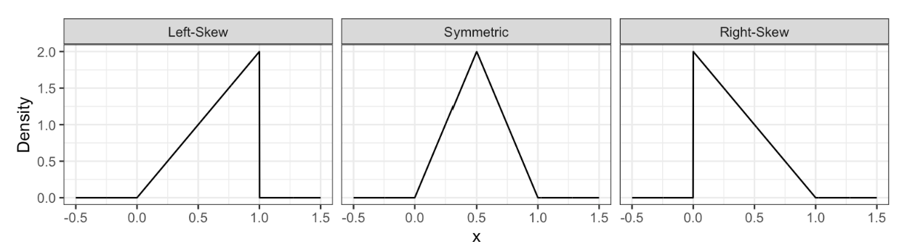

```{r setup, include=FALSE}
knitr::opts_chunk$set(echo = TRUE)
```


<!-- Probabilistic operators -->
\newcommand{\var}{\operatorname{Var}}
\newcommand{\cov}{\operatorname{Cov}}
\newcommand{\E}{\mathbb{E}}

<!-- Distributions -->
\newcommand{\nd}{\mathcal{N}}

<!-- Reals, Naturals, Integers, Rationals, and Complex Numbers -->
\newcommand{\R}{\mathbb{R}}
\newcommand{\N}{\mathbb{N}}
\newcommand{\Z}{\mathbb{Z}}
\newcommand{\Q}{\mathbb{Q}}
\newcommand{\C}{\mathbb{C}}

<!-- sin and cos and other trig with dynamically sized brackets -->
\newcommand\sinb[1]{ \sin\!{\left( #1  \right)} }
\newcommand\cosb[1]{ \cos\!{\left( #1  \right)} }
\newcommand\tanb[1]{ \tan\!{\left( #1  \right)} }
\newcommand\cotb[1]{ \cot\!{\left( #1  \right)} }
\newcommand\secb[1]{ \sec\!{\left( #1  \right)} }
\newcommand\cscb[1]{ \csc\!{\left( #1  \right)} }


<!-- sin and cos and other trig squared with dynamically sized brackets -->
\newcommand\sinsq[1]{ \sin^2\!{\left( #1  \right)} }
\newcommand\cossq[1]{ \cos^2\!{\left( #1  \right)} }
\newcommand\tansq[1]{ \tan^2\!{\left( #1  \right)} }
\newcommand\cotsq[1]{ \cot^2\!{\left( #1  \right)} }
\newcommand\secsq[1]{ \sec^2\!{\left( #1  \right)} }
\newcommand\cscsq[1]{ \csc^2\!{\left( #1  \right)} }

<!-- reciprocal -->
\newcommand\rcp[1]{ \frac{1}{#1} }


## Lecture 1

### Basic probability concepts: 

In general, the probability of an event $A$ occurring is denoted as $P(A)$ and is defined as\[
  P(A) = \frac{\text{Number of times event $A$ is observed}}{\text{Total number of events observed}}
\]
**as the number of events goes to infinity.**

- We heavily rely on the “frequency of events” to make estimations of specific parameters of interest in a population or system.
- This is basically the foundation of a frequentist approach: relying on the frequency (or “number”!) of events to estimate your parameters of interest.

**Law of total probability:** When partitioning the sample space (the set of all possible events), the sum of the probabilities of each event should be one.\[
\sum_{E\in \Omega}P(E) = 1.
\]

- In general, for a given event $A$, the law implies that\[
  1 = P(A) + P(A^c).
\]

**Inclusion-exclusion principle:**\[
P(A \cup B) = P(A) + P(B) - P(A \cap B),
\]\[
P(A \cup B \cup C) = P(A) + P(B) + P(C) - P(A \cap B) - P(B \cap C) - P(A \cap C) + P(A \cap B \cap C),\]
etc.

\

**Odds:** are quite helpful in comparing the probability of two events.\[
  o = \frac{p}{1-p},
\] where $p$ is the probability of an event.

- This implies \[ 
p = \frac{o}{o+1}.
\]


### Measures of central tendency and uncertainty:

**Central tendency:** a measure denoting a “typical” value in a random variable.

**Uncertainty:**a measure of how “spread” a random variable is

- Called **parameters** when it comes to a population
- Are estimated via **sample statistics**

**Mode:** the outcome having the highest probability (discrete) or highest probability density (continuous)

**Entropy:** a measure of uncertainty defined by \[
  H(X) = \sum_x P(X = x)\ln\left(\rcp{P(X = x)}\right)
\]
or\[
H(X) = \int_x f_X(x) \ln \left(\rcp{f_X(x)}\right) \text{d}x.
\]

- Always non-negative in the discrete case
- $H(X) = 0 \iff X \text{ is constant}$ in the discrete case.


**Expectation:** 
\[
\mathbb{E}(X) = \displaystyle \sum_x x \cdot P(X = x).
\] or\[
\mathbb{E}(X) = \displaystyle \int_x x \cdot f_X(x)
\]

- Can usually be estimated via the **sample mean**\[
\bar{X} = \frac{1}{n} \sum_{i=1}^n X_i\]


**Variance:** 
\[\text{Var}(X) = \mathbb{E}\{[X - \mathbb{E}(X)]^2\}.\]
\[\implies \text{Var}(X) = \mathbb{E}(X^2) - [\mathbb{E}(X)]^2.\]

- the variance is an expectation (specifically, the squared deviation from the mean)
- can usually be estimated via the **sample variance**\[
S^2 = \frac{1}{n-1} \sum_{i=1}^n (X_i - \bar{X})^2\]
- Always non-negative, and $\var(X) = 0 \iff X \text{ is constant}$

**Standard deviation:** The square root of the variance, \[
\sigma_{_X} = \sqrt{\var(X)}.
\]


\newpage

## Lecture 2

- To maximize entropy, you need equal probabilities for all the outcomes in the sample space. This indicates we have a uniform uncertainty over the whole range of possible outcomes.

- Helpful univariate distribution guide: http://www.math.wm.edu/~leemis/chart/UDR/UDR.html


### Binomial distribution: 

\[X \sim \text{Binomial} (n, \pi)\]

- $X$ is the number of successes in $n$ trials in which each trial has probability $\pi$ of success, independent of all other trials. 
- PMF: \[P(X = x \mid n, \pi) = {n \choose x} \pi^x (1 - \pi)^{n - x} \quad \text{for} \quad x = 0, 1, \dots, n.
\]

- Expected value:\[
\mathbb{E}(X) = n \pi\]

- Variance:\[
\text{Var}(X) = n \pi (1 - \pi)\]

### Families and Parameters:

- We refer to the entire set of Binomial probability distributions as the **Binomial family of distributions**.
- Specifying a value for both  $\pi$  and  $n$  results in a unique Binomial distribution.
- Since  $\pi$  and  $n$  fully specify a Binomial distribution, we call them **parameters** of the Binomial family, and we call the Binomial family a **parametric family** of distributions.
- There are other ways we can specify the distribution. For instance, specifying the mean and variance is enough to identify a Binomial distribution.
- Exactly which variables we decide to use to identify a distribution within a family is called the family’s parameterization.
- The parameterization you use in practice will depend on the information you can more easily obtain


### Geometric distribution: 

\[ X \sim \text{Geometric} (\pi)\]

$X$ is the number of trials **before** experiencing a success, where each trial has probability $\pi$ of success, independent of all other trials.  
- PMF: \[
P(X = x \mid \pi) = \pi (1 - \pi)^x  \quad \text{for} \quad x = 0, 1, \dots
\]

- Since there is only one parameter, this means that if you know the mean, you also know the variance!

- Expected value:\[
\mathbb{E}(X) = \frac{1 - \pi}{\pi}\]

- Variance:\[
\text{Var}(X) = \frac{1 - \pi}{\pi^2}\]


### Negative Binomial Distribution: 
\[
X \sim \text{Negative Binomial} (k, \pi)\]
- $X$ is the number of failed trials before experiencing $k$ successes,  where each trial has probability $\pi$ of success, independent of all other trials.
- PMF: \[
P(X = x \mid k, \pi) = {k - 1 + x \choose x} \pi^k (1 - \pi)^x  \quad \text{for} \quad x = 0, 1, \dots
\]

- The Geometric family results with $k = 1$.

- Expected value:
\[
\mathbb{E}(X) = \frac{k(1 - \pi)}{\pi}.\]

- Variance:
\[
\text{Var}(X) = \frac{k(1 - \pi)}{\pi^2}.\]


### Poisson Distribution: 

\[ X \sim \text{Poisson} (\lambda)\]

- $X$ is number of events occurring in a fixed interval of time or space, assuming that these events occur with a known constant mean rate (e.g. 3 events per minute or 5 events per meter) and independently of the time since the last event
- PMF\[
P(X = x \mid \lambda) = \frac{\lambda^x \exp(-\lambda)}{x!}  \quad \text{for} \quad x = 0, 1, \dots\]

- Expected value:
\[
\mathbb{E}(X) = \lambda.\]

- Variance:
\[
\text{Var}(X) = \lambda.\]

### Bernoulli Distribution: 
\[X \sim \text{Bernoulli}(\pi) \]

- $X$ is equal to one with probability $\pi$ and equal to zero with probability $1 - \pi$. 
- Basically a weighted coin-flip
- A special case of the Binomial family ($n = 1$)
- PMF: \[
P(X = x \mid \pi) = \pi^x (1 - \pi)^{1 - x} \quad \text{for} \quad x = 0, 1.\]

- Expected value:
\[ \mathbb{E}(X) = \pi. \]

- Variance:
\[\text{Var}(X) = \pi(1 - \pi).\]


\newpage 

## Lecture 3


### Joint distributions and marginal distributions: 
 
- A **joint distribution** is the distribution of $n$-tuples of random variables, where $n\geq 2$.
- The distribution of an individual variable is called the **marginal distribution** (sometimes just “marginal” or “margin”).
- The word “marginal” is not really needed when we are talking about a standalone random variable – there is no difference between the “marginal distribution of $X$” and the “distribution of $X$.” Therefore, we just use the word “marginal” to emphasize that the distribution is being considered in isolation from other related variables in the same process or system.


- Going from the initial marginal distributions to the joint distribution is not a straightforward procedure.
- It requires us to understand the dependency structure among the random variables
- If we assume that all the RVs are independent, then we can just multiply the probabilities from the marginal distributions to find the joint distribution

- If you have a joint distribution, then the marginal distribution of each individual variable follows as a consequence
- Just sum up (discrete) or integrate (continuous), and apply the law of total probability: \[
  P(A) = \sum_nP(A\cap B_n),
\]or\[
  P(A) = \int_yP(A\cap Y = y).
\]


### Independence: 
- $X$ and $Y$ are **independent** if 
\[
P(X = x \cap Y = y) = P(X = x) \cdot P(Y = y) \quad \forall_{x,y}
\]

- Equivalently: \[
P(X = x \mid Y = y) = P(X = x)  \quad \forall_{x,y}
\]

- In other words: $X$  and $Y$ are independent if knowing something about one of them tells us nothing about the other. 


### Dependence Measures:

**Covariance:** \[
\cov(X, Y) = \mathbb{E}[(X-\mu_X)(Y-\mu_Y)], 
\]
where $\mu_X = \mathbb{E}(X)$ and $\mu_Y = \mathbb{E}(Y)$.
\[
  \implies \operatorname{Cov}(X,Y) = \mathbb{E}(XY) - \mathbb{E}(X)\mathbb{E}(Y).
\]

- Note that \[
  \mathbb{E}(XY) = \mathbb{E}(X)\mathbb{E}(Y) \iff \cov(X,Y) = 0,
\]

- Also if $X$ and $Y$ are independent then $\cov(X,Y) = 0$.
- But the reverse implication does **not** hold in general!
- Zero covariance simply indicates that there is no **linear** trend 


**Pearson’s correlation:**

- $\cov(X,Y)$ is dependent on the scale of $X$ and $Y$. 
- e.g. $\cov(10X, Y) = 10\cov(X, Y)$. 
- Pearson's Correlation standardizes the scale according to the standard deviations of $X$ and $Y$: \begin{align*}
\operatorname{Corr}(X, Y) &= \mathbb{E} \left[
   \left(\frac{X-\mu_X}{\sigma_X}\right)
   \left(\frac{Y-\mu_Y}{\sigma_Y}\right)
\right] \\
&= \frac{\operatorname{Cov}(X, Y)}{\sqrt{\operatorname{Var}(X)\operatorname{Var}(Y)}}.
\end{align*}

- Can show that $-1 \leq \text{Corr}(X, Y) \leq 1$ using the Cauchy–Schwarz inequality
- a value of -1 implies a perfect negative linear relationship
- a value of 0 implies no linear relationship (not necessarily independent tho)
- a value of 1 implies a perfect linear relationship


**Kendall's $\tau_K$**:

- Another measure of correlation
- Measures **monotonic** dependence instead of linear dependence
- Used on samples of observations, not on entire known distributions
- Measures concordance between each pair of observation $(x_i, y_i)$ and $(x_j, y_j)$ with $i \neq j$.
- Concordant means
\begin{gather*}
x_i < x_j \quad \text{and} \quad y_i < y_j, \\
\text{or} \\
x_i > x_j \quad \text{and} \quad y_i > y_j;
\end{gather*}

- Discordant means
\begin{gather*}
x_i < x_j \quad \text{and} \quad y_i > y_j, \\
\text{or} \\
x_i > x_j \quad \text{and} \quad y_i < y_j;
\end{gather*}

- The formal definition is then\[
\tau_K = \frac{\text{Number of concordant pairs} - \text{Number of discordant pairs}}{{n \choose 2}},\]
where $n$ is the sample size.


**Mutual Information:**

- Defined as \[
H(X,Y) = \displaystyle \sum_x \displaystyle \sum_y P(X = x \cap Y = y)\log\left[\frac{P(X = x \cap Y = y)}{P(X = x) \cdot P(Y = y)}\right].
\]

- Not really used in D551.
- Apparently useful in Machine Learning.


### Variance of a linear combination:

\[
\operatorname{Var}(aX + bY) = a^2\operatorname{Var}(X) + b^2\operatorname{Var}(Y) + 2ab\operatorname{Cov}(X, Y).
\]


\newpage 

## Lecture 4

### Conditional probabilities and conditional distributions

- In general, for events $A$ and $B$, the conditional probability of $A$ given $B$ is\[
P(A \mid B) = \frac{P(A \cap B)}{P(B)}.\]

- If $X$ and $Y$ are two RVs, then $(X\mid Y=y)$ is a probability distribution
\[\sum_xP(X_{_{Y = y}} = x) = \sum_xP(X = x\mid Y=y) =1. \]
- And hence $Z = (X\mid Y=y)$ is also a random variable


### Law of total expectation:

- A marginal mean can be computed from the conditional means and the probabilities of the conditioning variable.
- The formula, known as the **Law of Total Expectation**, is \begin{align*}
\mathbb{E}_Y(Y) &= \sum_x \mathbb{E}_Y(Y \mid X = x) \cdot P(X = x)\\
&= \mathbb{E}_X [\mathbb{E}_Y(Y \mid X)].
\end{align*}

- Also note that the law of total probability implies that \begin{align*}
  P(Y = y) &= \sum_x P(Y = y \mid X = x) \cdot P(X = x)\\
  &= \E_X[P(Y = y \mid X = x)].
\end{align*}


### Conditional Independence:

- Note that even if $X$ and $Y$ are independent, they might not be independent when conditioning on some other RV $Z$. 
- We say that $X$ and $Y$ are conditionally independent given $Z$ if and only if
\[
P(X = x \cap Y = y \mid Z = z) = P(X = x \mid Z = z) \cdot P(Y = y \mid Z = z) \quad \forall_{x,y,z}
\]

- Equivalently: \[
P(X = x \mid Y = y,\ Z = z) = P(X = x \mid Z = z) \quad \forall_{x,y,z}
\]


#### Example of variables that are not independent but are conditionally independent:

- See https://pages.github.ubc.ca/MDS-2022-23/DSCI_551_stat-prob-dsci_students/conditional-probabilities.html#conditional-independence

- Let  $L$  be a student’s lab grade,  $Q$  be a student’s quiz grade, and $S$  represent whether the student is a Statistics major
- For simplicity, we will consider only Bernoulli random variables, so  L  and  Q  will only take on the values “high” and “low”, and $S$ takes on the values of "yes" or "no".


- $L$  and  $Q$  appear to have a mild positive correlation: when the lab grade is high, the quiz grade is a bit more likely to also be high.
- So $L$ and $Q$ are not independent.
- But $L$ and $Q$ are conditionally independent given $S$!!
- Intuition: When $L$ is high, it indicates that the student is more likely to be a statistics major, which in turn indicates that their quiz grade $Q$ is more likely to be high. However, this is the **only** reason why high lab grades are correlated with high quiz grades. If you already know that a person is (or is not) a Statistics major, then their lab and quiz grades are completely independent.

- Note that it is also possible to have the opposite case: two variables that are marginally independent, but not conditionally independent given a third variable.


\newpage 

## Lecture 5

### Continuous random variables:

- Continuous random variables have an uncountably infinite number of possible outcomes
- In practice, we can never measure anything on a continuous scale since any measuring instrument must always round to some precision.
- But we can use a continuous distribution if the quantity being measured has "enough" precision that the distance between two neighbouring measurements is "not a big deal".
- For example, if dealing with monetary quantities which are in the magnitude of millions of dollars, rounding to the nearest cent is no big deal.


### Probability Density:

- Continuous RVs have an associated **probability density function** (PDF)
- It measures the density of probability per unit. 
- The density of a RV $X$ is denoted as  $f_X(x)$ 
- In general, \[
  P(a\leq X \leq b) =   \int_{a}^b f_X(x) \text{d}x 
\]

- By the law of total probability, we have \[\int_{-\infty}^\infty f_X(x) \text{d}x = 1.
\]

- Note that \[
  P(X = a) =   \int_{a}^a f_X(x) \text{d}x = 0 \quad  \forall_a 
\]

- A PDF must be non-negative everywhere


### Distribution properties:

- See lecture 1 notes for definitions of mode, entropy, expectation, variance, and standard deviation.

- Recall that entropy can be negative for continuous RVs.

#### Median and Quantiles:

- The **median** is the outcome for which there is a 50-50 chance of seeing a greater (or lesser) value.
- By definition, \[P[X \leq \text{Median}(X)] = 0.5 = P[X \geq \text{Median}(X)].
\]

- Its empirical definition (i.e. the sample statistic version of median) is the "middle value" after sorting the observations from smallest to largest.

- Better than the mean in some ways because it is not as sensitive to outliers and reduces possibilities to two equally likely outcomes. 


- The **$p$-quantile**, denoted $Q_X(p)$, is the outcome with a probability $p$  of getting a smaller outcome. 
- By definition, \[P[X \leq Q_X(p)] = p.
\]

- So the 0.5-quantile is just the median.
- An empirically-based definition of the  $p$-quantile is the  $np$th largest (rounded up) observation in a sample of size  $n$.

##### Special Quantiles:

- The  0.25 ,  0.5 , and  0.75 -quantiles are called **quartiles**. 
- Often referred to as the 1st, 2nd, and 3rd quartiles, and denoted as $Q_1, Q_2,$ and $Q_3$, respectively.

\

- The  0.01 ,  0.02 , …, and  0.99 -quantiles are called **percentiles**.
- The  $p$-quantile will often be called the  $100p$th percentile; for example, the  40th percentile is the  0.4 -quantile, and the 97th percentile is the 0.97-quantile. 


#### Prediction Intervals


- A  $p\times 100$% prediction interval $[a,b]$ is such that \begin{align*}
  P(a\leq X \leq b) &= p,\\
  P(X \leq a) = \frac{1-p}{2},\\
  P(X \geq b) = \frac{1-p}{2}.\\
\end{align*}

- Clearly $a = Q_{_X}(\frac{1-p}{2})$
- Similarly, $b = Q_{_X}(1 - \frac{1-p}{2}) = Q_{_X}(\frac{1+p}{2})$ 


#### Skewness

- **Skewness** measures how “lopsided” a distribution is, as well as the direction of the skew.
- If the density is symmetric, then the skewness is 0.
- If the density is more “spread-out” towards the right/positive values, then the distribution is said to be right-skewed (positive skewness).
- If the density is more “spread-out” towards the left/negative values, then the distribution is said to be left-skewed (negative skewness).




- The mathematical definition is given by \[
  \text{Skewness}(X) = \mathbb{E} \left[ \left( \frac{X - \mu_X}{\sigma_X} \right)^3 \right].
\]


### Representing Distributions: 

- A PDF (or PMF) is just a representation of a distribution. It is not the distribution itself.
- There are alternative ways to represent a distribution.
- All of these representations capture everything about a distribution, meaning that if one of them is given, the other ones can be derived.


#### Cumulative Distribution Function

- The **cumulative distribution function** (CDF) is defined by \[
  F_X(x) = P(X \leq x)
\]

- It can be calculated as \[
F_X(x) = \int_{-\infty}^x f_X(t) \, \text{d}t.
\]

- It is unitless (because probability is unitless)

- A valid CDF $F_X(x)$ must satisfy the following requirements:
1. Must never decrease.
2. It must never evaluate to be < 0 or > 1.
3. $F_X(x) \rightarrow 0$ as $x \rightarrow -\infty$
4. $F_X(x) \rightarrow 1$ as $x \rightarrow \infty$.


#### Survival Function

- The **survival function**  $S_X(x)$ is defined by
\[
S_X(x)=P(X>x).
\]
- It is the CDF “flipped upside down”:
\[
S_X(x)=1-F_X(x)
\]


#### Quantile Function

- The **quantile function** takes a probability $p$ and maps it to the $p$-quantile.
- Mathematically, this means that \[
  Q(p) = F^{-1}(p).
\]
- The quantile function is the CDF with the axes swapped, or in other words, the CDF reflected diagonally.

\


- All these representations (PDF, CDF, survival function, quantile function) fully contain all the information about the distribution; they are different “views” of the same underlying random variable.


\newpage 

## Lecture 6


### Uniform Distribution:

\[
X \sim \operatorname{Uniform}(a, b).
\]

- Has uniform density between $a$ and $b$, where $a<b$. 
-PDF: 
\[
  f_X(x\mid a, b) = \frac{1}{b - a} \qquad \text{for} \quad a \leq x \leq b.
\]


### Gaussian (Normal) Distribution:
\[X \sim \mathcal N(\mu, \sigma^2).\]

- $\mu$ is the mean, $\sigma^2$ is the variance
- Follows a "bell-shaped" curve
- PDF: 
\[
f_X(x \mid \mu, \sigma^2) = \frac{1}{\sqrt{2\pi \sigma^2}} \exp \left[-\frac{(x - \mu)^2}{2\sigma^2} \right] \qquad \text{for} \quad -\infty < x < \infty.
\]


### Log-Normal Distribution:
\[X \sim \operatorname{Log-Normal}(\mu, \sigma^2).\]

- A random variable X is a Log-Normal distribution if the transformation $\ln(X)$ is Normal.
- Can't take the logarithm of a negative number, so must have $X\geq 0$.
- This means that 
\[
  \ln(X) \sim \mathcal N(\mu, \sigma^2)
\]
- PDF: 
\[ f_X(x \mid \mu, \sigma^2) = \frac{1}{x\sqrt{2\pi \sigma^2}} \exp \left\{ -\frac{[\log(x) - \mu]^2}{2\sigma^2} \right\} \qquad \text{for} \quad x \geq 0.
\]


### Exponential Distribution:
\[X \sim \operatorname{Exponential}(\lambda).\]

- The exponential family is for positive random variables, often interpreted as wait time for some event to happen.

- Characterized by a memoryless property, where after waiting for a certain period of time, the remaining wait time has the same distribution.

- Parameterized by the average rate $\lambda >0$ at which events happen.

- PDF: 
\[f_X(x \mid \lambda) = \lambda e^{-\lambda x} \qquad \text{for} \quad x \geq 0.\]


### Beta Distribution:
\[X \sim \operatorname{Beta}(\alpha, \beta).\]

- The Beta family of distributions is defined for random variables taking values between  0  and  1 , so is useful for modelling the distribution of proportions.
- Has the Uniform distribution as a special case.
- PDF: 
\[
f_X(x \mid \alpha, \beta) = \frac{\Gamma(\alpha + \beta)}{\Gamma(\alpha) \Gamma(\beta)} x^{\alpha - 1} (1 - x)^{\beta - 1} \qquad \text{for} \quad 0 \leq x \leq 1.
\]


### Weibull Distribution:
\[X \sim \operatorname{Weibull}(\lambda, k).\]


- A generalization of the Exponential family, which allows for an event to be more likely the longer you wait.
- characterized by two parameters, a scale parameter $\lambda > 0$ and a shape parameter $k > 0$ (where $k = 1$ results in the Exponential family).
- PDF: 
\[
f_X(x \mid \lambda, k) = \frac{k}{\lambda} \left( \frac{x}{\lambda} \right)^{k - 1} \exp^{-(x / \lambda)^k} \qquad \text{for} \quad x \geq 0.
\]


### Gamma Distribution:
\[X \sim \operatorname{Gamma}(k, \theta).\]


- A two-parameter distribution family with support on non-negative numbers.
- PDF: 
\[
f_X(x \mid k, \theta) = \frac{1}{\Gamma(k) \theta^k} x^{k - 1} \exp(-x / \theta) \qquad \text{for} \quad x \geq 0.
\]


### Relevant `R` Functions:

- Always take the form `<x><dist>`

\

- `<x>` is one of `d`, `p`, `q`, or `r`: 
- `d`: density function (PDF), i.e. $f_X(x)$
- `p`: cumulative distribution function (CDF), i.e. $F_X(x)$
- `q`: quantile function (inverse of CDF), i.e. $Q_{_X}(p)$
- `r`: random number generator.

\

- `<dist>` is an abbreviation of a distribution family
- Some abbreviations for `<dist>`:
- `unif`: Uniform (continuous).
- `norm`: Normal (continuous).
- `lnorm`: Log-Normal (continuous).
- `geom`: Geometric (discrete).
- `pois`: Poisson (discrete).
- `binom`: Binomial (discrete).


### Continuous Conditional Distributions:


- In the continuous world, we replace probabilities with densities.

- For example, if $X$ is continuous then
\[P(X = x \mid X \geq 2500) = \frac{P(X = x)}{P(X \geq 2500)}
\] is not a useful calculation, since $P(X = x) = 0$.
- Instead, we calculate the conditional density of $X$: 
\[
f_{X \mid X \geq 2500}(x) = \begin{cases} \frac{f_X(x)}{P(X \geq 2500)} &\text{for } x \geq 2500,\\
0 &\text{for } x < 2500\end{cases}.\]
- In general,
\[
f_{X \mid X \geq a}(x) = \begin{cases} \frac{f_X(x)}{P(X \geq a)} &\text{for } x \geq a,\\
0 &\text{for } x < a \end{cases}.\]


\


- Similarly, if $Y$ is continuous then
\[P(X = x \mid Y = 5) = \frac{P(X = x)}{P(Y = 5)}
\] is not a useful calculation, since $P(Y = 5) = 0$.
- Instead, we calculate \[
  f_{X|Y = 5}(x) = \frac{f_{X,Y}(x, 5)}{f_Y(5)}.
\]
- In general, 
\[
  f_{X|Y}(x) = \frac{f_{X,Y}(x, y)}{f_Y(y)}.
\]


\newpage 

## Lecture 7

### Continuous Independence:

- As per usual, in the continuous case we replace probabilities for densities
- Two continuous RVs $X$ and $Y$ are independent if \[f_{X,Y}(x, y) = f_X(x) \cdot f_Y(y) \quad \forall_{x,y}\qquad(1)\]
- Equivalently: \[
  f_{Y \mid X}(y) = f_Y(y) \quad \forall_{x,y}\qquad(2)
\]


- Intuitively, $(1)$ means that when slicing the joint density at various points along the $x$-axis or $y$-axis, the resulting 1-D function will be the same, up to some multiplication factor.
- e.g $f_{X,Y}(1, y) = f_X(1) \cdot f_Y(y)$ and $f_{X,Y}(2, y) = f_x(2) \cdot f_Y(y)$
- This means that all the slices along an axis will have the same shape
- Note that $f_{X,Y}(1,y)$ is **not** a PDF. The conditional PDF is \[
  f_{Y \mid X = 1}(y) = \frac{f_{X,Y}(1,y)}{f_X(1)} = f_Y(y),
\] which also follows directly from $(2)$.


### Direction of Dependence

- Contour plots are useful for determining if two RVs are dependent or not
- They also help determine the direction of dependence
- For two positively correlated variables, there is overall tendency of the contour lines to point up and to the right 
- For two negatively correlated variables, there is overall tendency of the contour lines to point down and to the right 


### Estimating the marginal distribution from the conditional:

- By the law of total probability, we have 
\[
f_Y(y) = \int_x f_{X,Y}(x,y)\ \text{d}x = \int_x f_{Y\mid X}(y)\ f_X(x)\ \text{d}x.\]

- This is equivalent to 
\[
f_Y(y) = \E_X [f_{Y\mid X}(y)].\]

- If we know the conditional densities and have a sample of $X$ as observed values $x_1, \ldots, x_n$, then we can empirically estimate \[
  f_Y(y) \approx \frac{1}{n} \sum_{i = 1}^n f_{Y\mid X_i}(y).
\]


- Similarly, for CDFs we have
\[
  F_Y(y) = \int_x F_{Y \mid X}(y)\ f_X(x) \ \text{d}x = \E_X[F_{Y\mid X}(y)].
\]
- And we can estimate the CDF empirically with 
\[
  F_Y(y) \approx \frac{1}{n}\sum_{i = 1}^n F_{Y\mid X_i}(y).
\]


### Estimating the marginal mean from the conditional:

- As in the discrete case, we have 
\[
  \mathbb{E}(Y) = \int_x m(x) \ f_{X}(x) \ \text{d}x = \mathbb{E}_X[\mathbb{E}_Y(Y \mid X = x)].
\]
- Let $m(x) = \mathbb{E}(Y \mid X = x)$. Then the above becomes \[
  \mathbb{E}(Y) = \E[m(X)]
\]
- In machine learning, a function like $m(x)$ is called a **model function**.
- When you fit a model using Supervised Learning, you usually end up with an estimate of m(x).
- Then, using the empirical mean, we have
\[
E(Y) \approx \frac{1}{n} \sum_{i=1}^n m(x_i).\]


### Estimating marginal quantiles from the conditional:

- Unfortunately, if you have the $p$-quantile of Y given X = x, then this does not give much info about the $p$-quantile of $Y$.
- This is because the average of quantiles is a horrible estimate for quantiles
- e.g. a mean of medians is a horrible estimate for the median.
- So we could calculate the $p$-quantile of $Y$ as an average using the same ideas as above, but the estimate would be almost worthless.


### Mutivariate Gaussian Distribution:

- A multivariate distribution family in which:
1. All RVs must have Gaussian marginals
2. All linear combinations of the marginals are Gaussian (called **Gaussian dependence**)

\

- In general, it has two parameters:
1. A mean vector, $\vec{\mu}$
2. A covariance matrix, $\boldsymbol{\Sigma}$

- $\vec{\mu}$ is just a vector of the marginal means.
- e.g. in the bivariate case we have \[
  \vec{\mu}=\begin{pmatrix} \mu_X \\ \mu_Y \end{pmatrix}
\]

\

- $\boldsymbol{\Sigma}$ is a symmetric matrix of marginal covariances, where the diagonal entries are the marginal variances.
- It is symmetric because $\cov(X,Y) = \cov(Y,X)$
- The diagonal entries are the marginal variances because $\cov(X, X) = \var(X)$.

\

- We can also look at a correlation matrix, $\boldsymbol{P}$
- Recall that \[
\rho_{XY} = \frac{\operatorname{Cov}(X, Y)}{\sqrt{\operatorname{Var}(X)\operatorname{Var}(Y)}} = \frac{\sigma_{XY}}{\sqrt{\sigma_X^2 \sigma_Y^2}}.\]
- This implies that $\rho_{XX} = 1$.
- Thus in the bivariate case the correlation matrix is 
\begin{align*}
\mathbf{P} &= \begin{pmatrix} \rho_{XX} & \rho_{XY} \\ \rho_{XY} & \rho_{YY} \end{pmatrix} \\
&= \begin{pmatrix} 1 & \rho_{XY} \\ \rho_{XY} & 1 \end{pmatrix}.
\end{align*}
- Note that the covariance matrix is always used in the parameterization of a multivariate Gaussian distribution, although the correlation matrix has other uses (e.g PCA)

- The above means that to fully specify a $d$-dimensional Gaussian distribution, we need:
- the means and variances of all $d$ random variables, and
- the $d \choose 2$ covariance or correlations between each pair of random variables

\

#### Properties of the Mutivariate Gaussian Distribution:

- For the multivariate Gaussian distribution, uncorrelated marginals implies independent marginals.

\

- Marginal distributions are Gaussian, by definition.
- The marginal distribution of a subset of variables can be obtained by just taking the relevant subset of means, and the relevant subset of the covariance matrix.

\


- Linear combinations of marginals are Gaussian, by definition.
- If we want to find the mean and variance of a linear combination, we apply the rules for expectation and variance of linear combinations:
\[
  \E[aX + bY] = a\E[X] + b\E[Y]
\] and
\[
\operatorname{Var}(aX + bY) = a^2\operatorname{Var}(X) + b^2\operatorname{Var}(Y) + 2ab\operatorname{Cov}(X, Y).
\]

- In the case of a multivariate Gaussian distribution this yields
\[
  \E[aX + bY] = a\mu_X + b\mu_Y
\] and
\[
\operatorname{Var}(aX + bY) = a^2\sigma_X^2 + b^2\sigma_Y^2 + 2ab\sigma_{XY}.
\]

- In the case of the variance for linear combinations of $n\geq 3$ marginals, the formula will need to include all pairwise covariances.


\ 

- Conditional distributions are Gaussian.
- If (X, Y) have a bivariate Gaussian distribution then the distribution of $Y$ given that $X = x$ is also Gaussian. 
- Its mean is 
\[
  \mu_{_{Y \mid X = x}} = \mu_Y + \frac{\sigma_Y}{\sigma_X} \rho_{XY} (x - \mu_X).
\]
- Its variance is 
\[
  \sigma^2_{_{Y \mid X = x}} = \ (1 - \rho_{XY}^2)\sigma_Y^2 .
\]
- The conditional mean is linear in $x$, passes through the mean $(\mu_X, \mu_Y)$, and has a steeper slope with higher correlation.
- The conditional variance is smaller than the marginal variance, and gets smaller with higher correlation. (But it does not depend on $x$)

